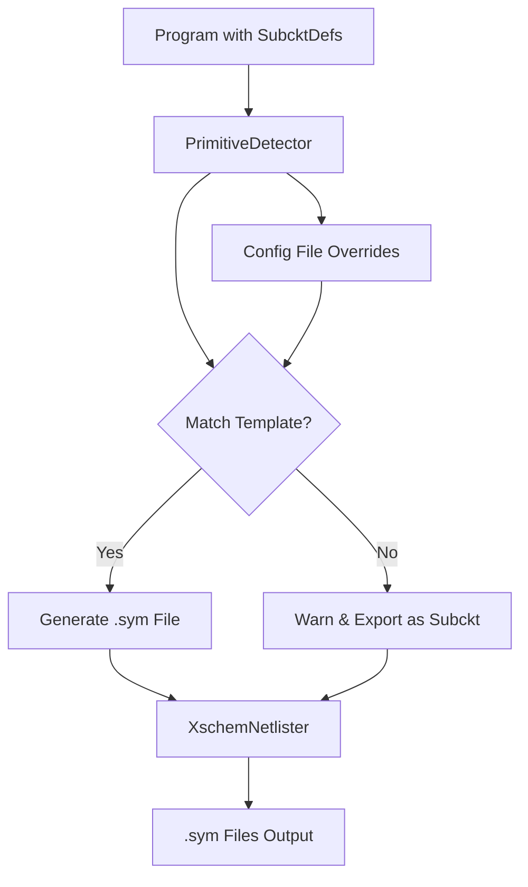

# Xschem Export Dialect Implementation

## Overview

Add xschem as a new export dialect that analyzes subcircuits to identify primitive templates and generates xschem .sym symbol files. Non-primitive subcircuits will be exported with warnings.

## Architecture



## Implementation Steps

### 1. Add XSCHEM to NetlistDialects

- **File**: [`netlist/data.py`](netlist/data.py)
- Add `XSCHEM = "xschem"` to `NetlistDialects` enum (line ~39)

### 2. Create Primitive Detection System

- **New File**: [`netlist/write/primitive_detector.py`](netlist/write/primitive_detector.py)
- Create `PrimitiveDetector` class with:
  - Heuristic-based detection for: mosfet, bjt, diode, resistor, capacitor, inductor
  - Config file support (JSON/YAML) for template overrides
  - Detection based on:
    - Port count (e.g., 4 ports for mosfet/bjt, 2 for resistor/diode/cap)
    - Parameter names (e.g., 'l', 'w' for mosfet; 'r' for resistor)
    - Subcircuit name patterns (e.g., contains 'mos', 'bjt', 'res')
    - Module references to models
  - Returns `PrimitiveType` enum (MOSFET, BJT, DIODE, RESISTOR, CAPACITOR, INDUCTOR, UNKNOWN)

### 3. Create Xschem Symbol Generator

- **New File**: [`netlist/write/xschem_symbol.py`](netlist/write/xschem_symbol.py)
- Create `XschemSymbolGenerator` class that:
  - Generates .sym file format for each primitive type
  - Defines pin positions and attributes for each primitive
  - Sets `type`, `format`, `template`, and `spice_primitive` attributes
  - Handles parameter mapping from subcircuit params to xschem attributes

### 4. Create XschemNetlister

- **New File**: [`netlist/write/xschem.py`](netlist/write/xschem.py)
- Create `XschemNetlister` class inheriting from `Netlister`:
  - Override `write_subckt_def()` to:
    - Use `PrimitiveDetector` to identify primitive type
    - If primitive: generate .sym file using `XschemSymbolGenerator`
    - If not primitive: log warning and export as regular subcircuit
  - Generate one .sym file per primitive type (e.g., `mosfet.sym`, `bjt.sym`)
  - Handle parameter declarations and port mappings
  - Support config file path in WriteOptions

### 5. Update Write Module

- **File**: [`netlist/write/__init__.py`](netlist/write/__init__.py)
- Import `XschemNetlister`
- Update `netlist()` function (line ~188) to dispatch to `XschemNetlister` when `fmt == NetlistDialects.XSCHEM`

### 6. Update WriteOptions

- **File**: [`netlist/write/__init__.py`](netlist/write/__init__.py)
- Add optional `primitive_config_file` parameter to `WriteOptions` class (line ~103)
- Pass config file path to `XschemNetlister` if provided

### 7. Add Docker-Based Testing

- **New File**: `tests/integration/test_xschem.py` or update existing test file
- Create integration test that:
  - Generates .sym files for various primitive types
  - Uses docker to run xschem validation (hpretl/iic-osic-tools image)
  - Docker command pattern (similar to xyce):
    ```bash
    docker run --rm -v $(pwd):/workspace -w /workspace --user $(id -u):$(id -g) hpretl/iic-osic-tools xschem <test_file.sym>
    ```

    - Mounts current directory (repository root) to `/workspace`
    - Uses current user ID to avoid permission issues
    - Runs xschem validation on generated .sym files
  - Validates that xschem can successfully open and parse the generated .sym files
  - Tests that xschem recognizes the symbols as valid primitives
  - Verify no parsing errors when xschem loads the .sym files

## Key Design Decisions

1. **Primitive Detection**: Reuse heuristics from `SpiceNetlister.write_subckt_instance()` (lines 579-627) but extend to analyze `SubcktDef` structures rather than instances
2. **Symbol File Format**: Generate xschem .sym files with proper attributes (`type`, `format`, `template`, `spice_primitive=true`)
3. **Output Structure**: Generate separate .sym files per primitive type in output directory
4. **Non-Primitives**: Export as subcircuits with warnings logged via `log_warning()`

## Files to Create

- `netlist/write/primitive_detector.py` - Primitive detection logic
- `netlist/write/xschem_symbol.py` - Symbol file generation
- `netlist/write/xschem.py` - Main xschem netlister
- `tests/integration/test_xschem.py` - Docker-based integration tests for xschem validation

## Files to Modify

- `netlist/data.py` - Add XSCHEM enum value
- `netlist/write/__init__.py` - Add XschemNetlister dispatch and config option